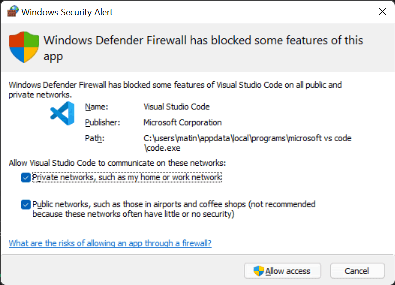

# Installation Guide - Windows

If you are viewing this in Visual Studio Code, press `ctrl + shift + v` to open this in preview mode.

## What You Will Be Installing

1. Microsoft Teams
2. Visual Studio Code (Recommended) and Plugins
3. Git for Windows and Github
4. Node.js (latest LTS version) and NPM Packages
5. Chrome, Firefox, or Edge (Recommended)

## Microsoft Teams

Before class began, you should have received emails and training from CanCode Communities about on how to install, setup, and use Microsoft Teams.

## Visual Studio Code (Recommended)

Visual Studio Code is an IDE, which is an intelligent code editor. We will be teaching with Visual Studio Code and highly recommend that you use it too. If you are experienced with programming and the command line, and you believe that you can translate whatever we teach you in Visual Studio Code to your editor of choice, you may opt for another editor, but we will not be able to help you if problems arise.

To install, go to https://code.visualstudio.com and click on the _Download Windows Universal_ dropdown and select the _Stable_ version.

When it finishes downloading, double click on the downloaded _.exe_ file and accept the License Agreement. You will accept all of the defaults until you get to the _Select Additional Tasks_ screen. Here are the settings that I use. Be sure to check _Add to PATH_.


If you see this security warning at any time during our class, click on _Open_.


Continue with the installer. When it finishes, Visual Studio Code should open. When it does, close out of it for now. We will revisit Visual Studio Code once we finish installing a few dependencies.

## Git for Windows and Github

**We would like you to install Git Bash because it supports Unix style commands. If you have Git installed but not Git Bash, then you should remove Git and follow the instruction below to reinstall.**

Git is version control software. It is used for sharing code, combining team members' code and managing different versions of your code.

You will need to [create a Github account](https://github.com/signup?ref_cta=Sign+up&ref_loc=header+logged+out&ref_page=%2F&source=header-home) if you do not have one.

To install git, got to https://git-scm.com/downloads and click on _Windows_.

When it finishes downloading, open the installer. If you are asked to allow the app to make changes to your device, click on _Yes_. Below is the recommended git settings. If you do not see instructions for whatever screen you are on, then accept the defaults.

### Select Components

I suggest you check the following:


### Choose the default editor used by Git

We recommend you select _Use Visual Studio Code as Git's default editor_ from the dropdown. If you prefer another code editor, you can select it from the list.


### Configuring the line-endings conversions

To avoid unnecessary merge conflicts (believe me, merge conflicts are very frustrating), please make sure _Checkout Windows-style, commit Unix-style line endings_ is selected.

When you finish installing, you should see Git Bash on your computer. Open it, type `git --version` to confirm that it works.

## Node.js and NPM Packages

Node.js is a JavaScript runtime engine. It allows you to run JavaScript programs outside of Chrome, Safari, Edge or another web browser.

You will need to have the latest LTS version of Node installed as of September 2024 (20.x). If you already have Node.js installed, type `node -v` in Git Bash. If you do not have the latest version, you will need to reinstall it again.

To install or resinstall Node.js, go to https://nodejs.org/en/ and click on the _20.x.x LTS_ version.

When it finishes downloading, open the downloaded file. Accept the License Agreement and all of the defaults. If you are asked to allow the app to make changes to your device, click on _Yes_.

When it’s finished installing, open Git Bash and type `node -v` to confirm that it has installed. If you had Git Bash open before installing Node.js and you get an error, try reopening Git Bash and see if this resolves the issue.

### NPM

Update NPM with:

```bash
npm install -g npm@latest
```

## Visual Studio Code Setup and Extensions

### Setting Git Bash as your Default Shell

In Visual Studio Code, press `ctrl + shift + p`, search for _terminal_ and select _Terminal: Select Default Profile_. Then choose _Git Bash_.


Reopen your terminal window:

- In your main menu, go to "View" > "Terminal". This should close the terminal.
- Repeat. This should open the terminal window.

If Git Bash opens inside of Visual Studio Code, then it worked.


### ESLint Extension

Open the Extensions tab on the left, search for _ESLint_ and install _ESLint_.


Once its installed, the _Install_ button may have transformed into a _Reload_ button. If you see _Reload_, click on it.

### Bracket Colorization Setting

Bracket Colorization is a simple setting that makes it much easier to debug issues with closes curly braces, brackets, and parentheses. To enable, press `ctrl + shift + p`. Search for _settings_ and click on _Open Settings (UI)_.


Then search for _bracket pair colorizer_. You should see the setting _Editor > Bracket Pair Colorization_. Click on the checkbox to enable it.


### Quokka.js

[Quokka.js](https://quokkajs.com/docs/?editor=vsc) is a sandbox that lets you play with JavaScript inside Visual Studio Code and other popular code editors. Search for _Quokka_ in the Extensions tab on the left and install _Quokka.js_. Once its installed, click on _Reload_ if necessary.

If Quokka prompts you to go Pro, select _'Community' features only_.


If you get this Windows Security Alert from Windows when running Quokka, make sure both options are checked and click on _Allow access_.



### Prettier Extension (Optional)

Prettier automatically formats your code and you can configure it to format your code whenever you save a file. Using this is optional for now but we will require it for group projects.

If you would like to use prettier, search for _Prettier_ in the Extensions tab on the left and install _Prettier - Code formatter_. Once its installed, click on _Reload_ if necessary.

You can now adjust Visual Studio's settings so that it will format on save and will play nicely with Prettier's defaults. Press `ctrl + shift + p,` search for _settings_ and click on _Preferences: Open Settings (JSON))_.


Paste the following into the JSON file. Do not overwrite any settings that you already have.

```json
  "editor.formatOnSave": true,
  "editor.insertSpaces": true,
  "editor.tabSize": 2,
```

## Chrome, Firefox, or Edge (Recommended)

You should use any modern browser that has good Developer Tools available. (In other words, not Internet Explorer). We recommend Chrome because we will be demonstrating Chrome's tools in class. Firefox and Edge are also a great choices.

- [Chrome](https://www.google.com/chrome/)
- [Firefox](https://www.mozilla.org/en-US/firefox/)
